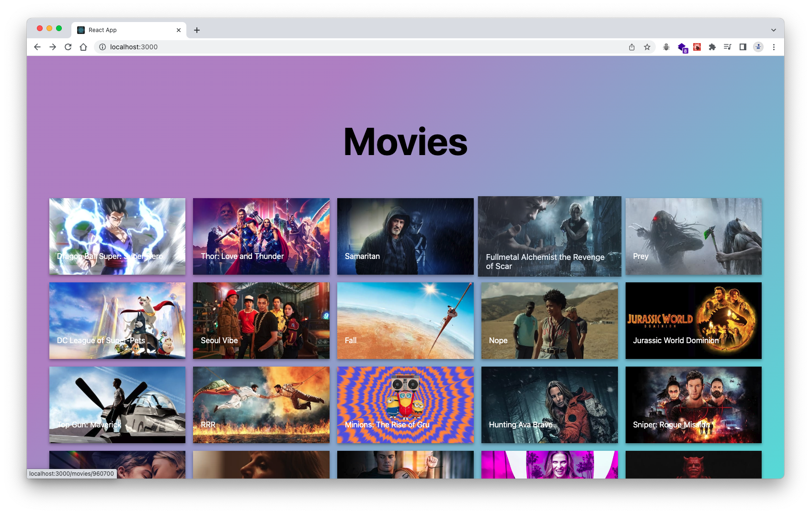
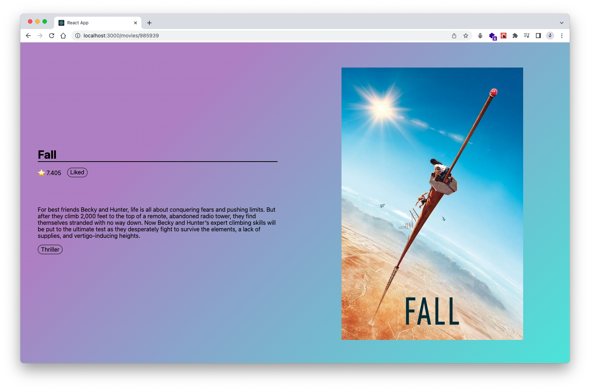

# Movie Curation App

A movie curation app consists of two pages using a custom-built GraphQL API, which wraps the existing REST API to retrieve the specific data that need in the app.

## Features & Screenshots

- Hover over effect on each movie card

- `Like` using GraphQL's local only field to track a user click `Like` or not
